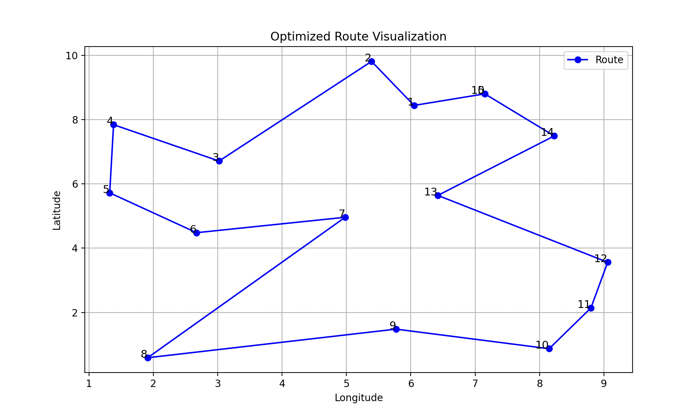

# Route Optimizer for Property Engineers

This Python app optimizes routes for property engineers visiting multiple locations throughout their workday. It can use different strategies to find the shortest path -- currently, Nearest Neighbor is the main algorithm used, with an option to apply the Two Opt algorithm for improvement.

Check out the branch `timing-and-prioritization` for a version that considers time windows and prioritizes certain locations. Still WIP for now, but it's a good demonstration on how this can be extended for a more realistic use case.

## Installation

After cloning the repo,
1. Create a virtual environment and activate it:
```bash
python -m venv venv
source .venv/bin/activate  # On Windows, venv\Scripts\activate
```

2. Install dependencies:
```bash
pip install -r requirements.txt
```

## Usage

The system accepts location data in a simple CSV format:
```
x,y
0,0
10,20
15,30
```

To run the app, run the following command:
```bash
python main.py
```

This will read the locations from `delivery_points.txt` and output the optimized route and total distance, defaulting to the Nearest Neighbor strategy. Additional CLI options:
- `--nn`: Use the Nearest Neighbor strategy
- `--two_opt`: Use the Two Opt strategy
- `--visualize`: Visualize the route with Matplotlib

e.g.
```bash
python main.py --two_opt --visualize
```

**Example visualization result for Nearest Neighbor**


**Example visualization result for Two Opt**


You can also run tests by executing:
```bash
python -m unittest test.py
```

## Considerations

I assumed that the delivery points would be floating point values. Unit tests are included to check that the input is valid.

Using the nearest neighbour algorithm is a good starting point, but it may not always be the optimal solution. However, it is quite efficient when we have a medium to large number of delivery points.

It's not clear from the problem statement if the property engineer should return to their starting point or not. As with other traveling salesmen problems, I assumed that they should.

## Deployment Strategy

I'd like to be particularly careful since it directly affects the property engineers' daily work.

Before any code reaches users, we'll run it through comprehensive testing should go beyond just checking if the code works. Our unit tests need to pass, of course, but it's ideal to test the system with real-world scenarios. 

Once the first tests look good, we should move to staging (which should mirror the prod setup) then feed it historical data from actual property engineer routes. This lets us compare against routes that we know exist in the real world.

Also, this is a nice way to look at not just if the routes are technically possible, but if they make practical sense for PEs.

I'd use a blue-green deployment for prod releases, i.e. set up a parallel env with the new version, then slowly switch traffic over to it. It's pretty safe because if something goes wrong, we can immediately switch back to the previous one, and PEs won't be stuck with a broken routing system. Also, should always look to do this during off-peak hours to minimize disruption.

## Monitoring Plan

For technical performance, like tracking how long it takes to calculate each route, how much memory we're using, or how many iterations it takes to find a good solution, we can use Prometheus/Grafana. ELK stack is also a good option for logging and going through these logs. I'm also partial to adding telemetry to the codebase to track things like request counts, error rates and latency, but it could be a bit overkill for now. 

To monitor the business impact like if the routes are actually working for PEs, we can track things like the average route length, and whether engineers are able to meet their time windows. If we see PEs consistently running behind schedule or missing appointments, we want to get notified and take the appropriate actions. One option to send out notifications is through PagerDuty. If we want something a bit more simple, we can set up Slack notifications (which is just a webhook, IIRC).

I'd first look to set up alerts for situations that need immediate attention -- like if route calculations start taking more than 30 seconds, which would be way too long for real-world use. Or if we see memory usage climbing above 80% too fast, we might be heading for problems. And if we notice multiple time window violations in a short period, something might be wrong with the strategy being used.